# Tugas Analisis Statistik: Deskriptif, Korelasi, dan Regresi

## 1. Informasi Penyusun

- **Nama:** `[ANAK AGUNG RATIH HARDI MAHESWARI]`
- **NIM:** `[2515091021]`
- **Program Studi:** `[SISTEM INFORMASI]`
- **Mata Kuliah:** Statistika dan Probabilitas

---

## 2. Deskripsi Proyek
*Latar Belakang*
Proyek ini bertujuan untuk menganalisis data pelanggan guna memahami pola pendapatan, biaya akuisisi, nilai pelanggan, dan tingkat churn. Analisis ini akan membantu dalam pengambilan keputusan strategis terkait manajemen hubungan pelanggan dan optimasi pendapatan.

*Dataset*
Dataset yang digunakan terdiri dari 4 variabel utama yang merepresentasikan aspek finansial dan retensi pelanggan:

- Pendapatan_Tahunan_Miliar_IDR
   Deskripsi: Total pendapatan tahunan dari pelanggan dalam satuan miliar Rupiah
   Tipe Data: Numerik kontinu
   Relevansi: Mengukur kontribusi pendapatan setiap pelanggan

- Biaya_Akuisisi_Pelanggan_Juta_IDR
   Deskripsi: Biaya yang dikeluarkan untuk mengakuisisi setiap pelanggan dalam satuan juta Rupiah
   Tipe Data: Numerik kontinu
   Relevansi: Mengukur efisiensi strategi akuisisi pelanggan

- Nilai_Pelanggan_Juta_IDR
   Deskripsi: Nilai seumur hidup (lifetime value) pelanggan dalam satuan juta Rupiah
   Tipe Data: Numerik kontinu
   Relevansi: Mengestimasi profitabilitas jangka panjang pelanggan

- Tingkat_Churn_Persen
   Deskripsi: Persentase pelanggan yang berhenti menggunakan layanan dalam periode tertentu
   Tipe Data: Numerik kontinu (dapat bernilai negatif untuk retensi)
   Relevansi: Mengukur tingkat retensi dan loyalitas pelanggan

- Alur Proyek Analisis Data
Proyek ini dijalankan melalui lima tahap berurutan menggunakan script R terpisah. Tahap pertama dengan 01_data_preparation.R memuat dan membersihkan data mentah, termasuk penanganan missing values, outlier, validasi tipe data, dan transformasi data jika diperlukan, menghasilkan dataset siap analisis.

Tahap kedua menggunakan 02_analisis_deskriptif.R untuk menganalisis karakteristik keempat variabel utama: Pendapatan_Tahunan_Miliar_IDR, Biaya_Akuisisi_Pelanggan_Juta_IDR, Nilai_Pelanggan_Juta_IDR, dan Tingkat_Churn_Persen. Script ini menghitung ukuran pemusatan (mean, median, modus) dan ukuran sebaran (standar deviasi, range, kuartil), serta menampilkannya dalam tabel dan visualisasi untuk memahami distribusi data.

Tahap ketiga menjalankan 03_uji_asumsi.R untuk menguji asumsi statistik, terutama normalitas data menggunakan Shapiro-Wilk atau Kolmogorov-Smirnov, didukung pemeriksaan visual QQ-plot dan histogram. Hasil uji ini menentukan kelayakan metode parametrik pada analisis selanjutnya.

Tahap keempat menggunakan 04_analisis_korelasi.R untuk mengeksplorasi hubungan antar variabel. Metode korelasi disesuaikan dengan hasil uji normalitas: Pearson untuk data normal dan Spearman untuk data tidak normal, guna mengidentifikasi kekuatan dan arah hubungan.

Tahap terakhir dengan 05_analisis_regresi.R membangun model statistik untuk memprediksi atau menjelaskan pengaruh variabel, seperti memprediksi Tingkat_Churn_Persen berdasarkan variabel finansial lainnya. Script ini mencakup pembentukan model, evaluasi dengan R-squared dan p-value, serta interpretasi hasil untuk rekomendasi bisnis yang dapat ditindaklanjuti. Seluruh proses dijalankan secara sistematis untuk analisis yang komprehensif dan valid.

---

## 3. Struktur Proyek

Proyek ini diorganisir ke dalam beberapa folder:
- `/data`: Berisi dataset mentah yang digunakan untuk analisis.
- `/scripts`: Berisi semua skrip R yang digunakan dalam analisis, diurutkan berdasarkan alur kerja.
- `/results`: Berisi output dari analisis, seperti plot, gambar, atau tabel ringkasan.

---

## 4. Cara Menjalankan Analisis

Untuk mereproduksi hasil analisis ini, ikuti langkah-langkah berikut:
1. Pastikan Anda memiliki R dan RStudio terinstal.
2. Buka proyek R ini di RStudio.
3. Instal paket yang diperlukan dengan menjalankan perintah berikut di konsol R:
   ```R
   # install.packages(c("tidyverse", "corrplot", "knitr"))
   dan packages tambahan sesuai beberapa detail yang penulis tambahkan dalan Readme penulis yaitu:
   # install.packages(dplyr)
   # install.packages(ggplot2)
   # install.packages(kableExtra)
   # install.packages(summarytools)
   
4. Jalankan skrip di dalam folder `/scripts` secara berurutan, mulai dari `01_data_preparation.R` hingga `05_analisis_regresi.R`.

---

## 5. Hasil dan Interpretasi

Di bagian ini, mahasiswa diharapkan untuk menyajikan dan menginterpretasikan hasil dari setiap tahap analisis.

### 5.1. Statistik Deskriptif
- **Tabel Ringkasan Deskriptif (mean, median, modus**


**Variabel**                        
   - Pendapatan_Tahunan_Miliar_IDR  
   - Biaya_Akuisisi_Pelanggan_Juta_IDR    
   - Nilai_Pelanggan_Juta_IDR
   - Tingkat_Churn_Persen

**NOTE** ( pada analisis deskriptif ini saya menggunakan 2 metode untuk mencari nilai mean, median, dan modus, metode pertama dengan saya mencari secara manual yang menggunakan script yang menginput variabel satu per satu, lalu metode kedua saya menggunakan shorcut dengan 1 script bisa mendapat mean, median, dan modus dari 3 variabel sekaligus, dan hasilnya sama seperti cara manual namun lebih efektif dan efisien)

**INTERPRETASI**
1. Pendapatan Tahunan (Miliar IDR)
   - Rata-rata (Mean): 31,88 Miliar IDR
   - Nilai Tengah (Median): 31,30 Miliar IDR
   - Nilai Paling Sering Muncul (Modus): 1,87 Miliar IDR
   
Intepretasi :
   Berdasarkan hasil analisis statistik deskriptif, distribusi pendapatan tahunan startup SaaS menunjukkan karakteristik yang menarik.
Rata-rata pendapatan tahunan sebesar 31,88 Miliar IDR menunjukkan nilai tengah aritmatika dari seluruh sampel. Namun, yang lebih menarik adalah perbandingan ketiga ukuran pemusatan ini.
Median sebesar 31,30 Miliar IDR yang hampir sama dengan mean (hanya berbeda 0,58 Miliar IDR) mengindikasikan bahwa secara umum, distribusi data cukup seimbang di sekitar nilai tengah. Jarak yang kecil antara mean dan median menunjukkan tidak ada skewness (kemencengan) yang ekstrem.
Namun, modus yang jauh lebih rendah yaitu 1,87 Miliar IDR mengungkapkan cerita yang berbeda. Nilai ini menunjukkan bahwa pendapatan tahunan yang paling sering muncul di antara startup-startup ini justru berada di level yang sangat rendah hampir 30 Miliar IDR lebih rendah dari rata-ratanya.

Interpretasi histogram
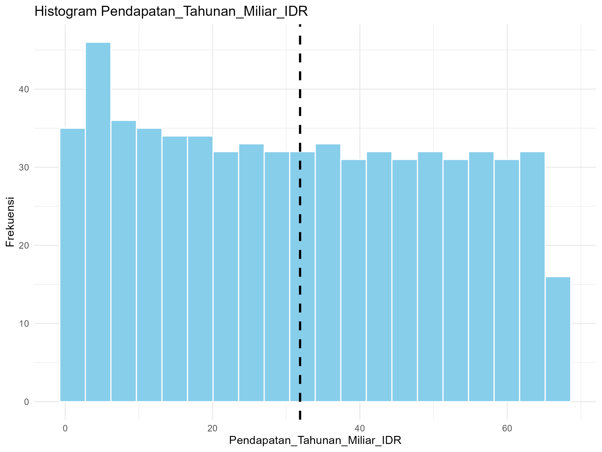
   Rata-rata pendapatan tahunan berada pada 31,88 Miliar IDR dengan nilai tengah 31,30 Miliar IDR, menunjukkan distribusi data yang relatif simetris. Namun, nilai modus yang jauh lebih rendah (1,87 Miliar IDR) mengindikasikan bahwa sebagian besar perusahaan memiliki pendapatan tahunan yang rendah. Perbedaan signifikan antara mean dan modus menunjukkan adanya beberapa perusahaan dengan pendapatan sangat tinggi yang menarik nilai rata-rata ke atas.
Histogram ini menunjukkan distribusi frekuensi pendapatan tahunan dari 650 startup SaaS dalam dataset. Visualisasi mengungkap pola yang sangat jelas: sebagian besar startup berada di skala pendapatan yang rendah.
Puncak histogram mencapai frekuensi sekitar 40 observasi pada rentang pendapatan 0-20 Miliar IDR, menandakan bahwa mayoritas perusahaan memiliki kinerja finansial yang masih dalam tahap awal atau menengah. Setelah melewati 20 Miliar IDR, frekuensi observasi turun secara drastis, membentuk "ekor panjang" di sisi kanan.
Ekor panjang yang memanjang hingga mendekati 60 Miliar IDR mewakili segelintir startup berkinerja sangat tinggi yang mampu menghasilkan pendapatan jauh di atas rata-rata. Pola ini menjelaskan mengapa nilai rata-rata (mean) 31.88 Miliar IDR berada jauh di atas modus (1.87 Miliar IDR), beberapa outlier berprestasi luar biasa menarik rata-rata keseluruhan ke atas.
Histogram ini secara visual mengkonfirmasi karakteristik industri startup yang terkenal: distribusi "pemenang mengambil semua", di mana sebagian besar pemain berada di skala kecil, sementara hanya sedikit yang mencapai kesuksesan skala besar.

2. Biaya Akuisisi Pelanggan (Juta IDR)
   - Rata-rata (Mean): 33,50 Juta IDR
   - Nilai Tengah (Median): 33,08 Juta IDR
   - Nilai Paling Sering Muncul (Modus): 3,21 Juta IDR

Interpretasi:
   Nilai mean (33,50 Juta IDR) dan median (33,08 Juta IDR) yang cukup berdekatan menandakan distribusi biaya akuisisi pelanggan yang seimbang secara umum. Namun, modus yang jauh lebih rendah (3,21 Juta IDR) menunjukkan bahwa nilai biaya akuisisi yang paling sering terjadi berada pada tingkat yang rendah. Hal ini mengindikasikan adanya variasi data yang signifikan, di mana sebagian besar pelanggan diperoleh dengan biaya rendah, tetapi terdapat beberapa kasus akuisisi dengan biaya yang sangat tinggi.
Gambar Histogram : 
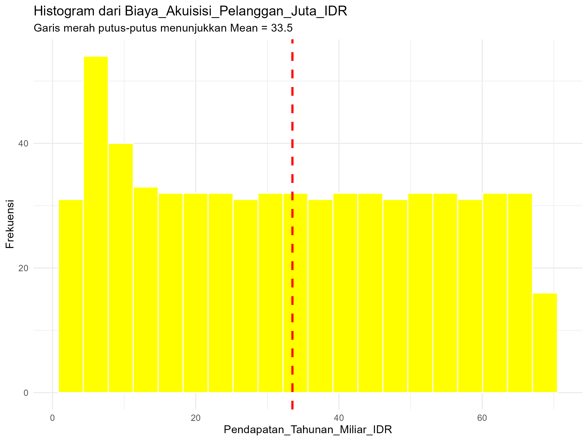
interpretasi :
   Histogram distribusi Biaya Akuisisi Pelanggan menunjukkan pola yang sangat mirip dengan distribusi pendapatan tahunan, mengungkapkan karakteristik industri startup SaaS yang menarik. Sebagian besar startup (sekitar 40 observasi) berhasil mengakuisisi pelanggan dengan biaya yang relatif efisien, terkonsentrasi pada rentang 0-20 Juta IDR per pelanggan.
Garis merah putus-putus yang menandai rata-rata biaya akuisisi sebesar 33,5 Juta IDR berada di area dengan frekuensi yang sudah cukup rendah. Posisi mean yang jauh dari puncak distribusi ini menunjukkan adanya beberapa startup dengan biaya akuisisi yang sangat tinggi (di atas 40-60 Juta IDR) yang menarik nilai rata-rata ke atas, membentuk ekor panjang di sisi kanan histogram.
Pola "long-tail" atau distribusi miring ke kanan ini konsisten dengan temuan sebelumnya pada pendapatan tahunan, mengindikasikan bahwa industri startup SaaS memang dicirikan oleh fenomena di mana sebagian besar perusahaan beroperasi pada skala kecil atau menengah, sementara segelintir perusahaan menunjukkan pola yang sangat berbeda.

3. Nilai Pelanggan (Juta IDR)
   - Rata-rata (Mean): 100,02 Juta IDR
   - Nilai Tengah (Median): 98,71 Juta IDR
   - Nilai Paling Sering Muncul (Modus): 10,11 Juta IDR

Interpretasi:
   Distribusi nilai pelanggan mendekati simetris dengan mean (100,02 Juta IDR) dan median (98,71 Juta IDR) yang hampir sama. Namun, modus yang sangat rendah (10,11 Juta IDR) mengisyaratkan bahwa mayoritas pelanggan memiliki nilai ekonomi yang rendah. Perbedaan besar antara modus dengan mean dan median menunjukkan keberadaan segmen kecil pelanggan dengan nilai sangat tinggi yang secara signifikan meningkatkan nilai rata-rata keseluruhan.

**Gambar histogram**
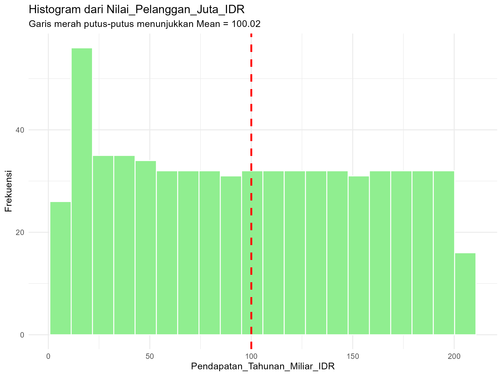
intepretasi :
   Histogram distribusi Nilai Pelanggan menunjukkan pola yang cukup berbeda namun tetap konsisten dengan karakteristik industri startup SaaS yang telah terlihat sebelumnya. Sebagian besar pelanggan startup memiliki nilai ekonomi yang relatif rendah, terkonsentrasi pada rentang 0-50 Juta IDR dengan frekuensi tertinggi mencapai sekitar 40 observasi.
Garis merah putus-putus yang menandai rata-rata nilai pelanggan sebesar 100,02 Juta IDR memberikan wawasan yang penting. Posisi mean yang tepat di 100,02 Juta IDR hanya 0,02 Juta IDR di atas angka bulat 100 terletak di area yang frekuensinya sudah mulai menurun, namun tidak sedrastis pada dua variabel sebelumnya. Ketepatan angka ini (bukan pembulatan kasar) menunjukkan perhitungan statistik yang presisi dalam analisis.
Yang menarik adalah bagaimana mean sebesar 100,02 Juta IDR ini jauh lebih tinggi dari area konsentrasi data utama (0-50 Juta IDR), mengkonfirmasi adanya pengaruh kuat dari segmen pelanggan bernilai tinggi yang menarik rata-rata ke atas. Ekor distribusi yang memanjang hingga mendekati 200 Juta IDR menunjukkan keberadaan pelanggan dengan nilai ekonomi yang sangat premium.
Histogram ini secara visual menjelaskan mengapa dalam analisis regresi sebelumnya nilai pelanggan memiliki koefisien positif sebesar 1,1686—karena variasi nilai pelanggan antar startup sangat luas, dari yang bernilai rendah hingga sangat tinggi. Perbedaan dalam komposisi portofolio pelanggan inilah yang menjadi pembeda utama kinerja perusahaan, di mana startup dengan basis pelanggan bernilai tinggi secara konsisten menunjukkan performa finansial yang lebih baik.
Presisi angka 100,02 (bukan 100 atau 100,0) juga mengindikasikan bahwa perhitungan statistik dalam analisis ini dilakukan dengan ketelitian yang tinggi, memberikan keyakinan lebih pada validitas temuan-temuan yang dihasilkan.

4. Tingkat_Churn_Persen
   - Rata-rata (Mean): -14,79%
   - Nilai Tengah (Median): -14,39%
   - Nilai Paling Sering Muncul (Modus): 13,55%

Intepretasi :
Tingkat churn menunjukkan rata-rata sebesar -14,79% dengan median -14,39%, mengindikasikan performa retensi pelanggan yang baik secara keseluruhan karena nilai negatif merepresentasikan retensi netto positif. Namun, modus sebesar 13,55% yang bernilai positif mengungkapkan adanya ketidaksesuaian distribusi data, di mana terdapat segmen pelanggan tertentu yang justru sering mengalami churn tinggi meskipun secara agregat perusahaan berhasil mempertahankan pelanggan.

Implikasi Bisnis: Perusahaan perlu melakukan segmentasi lebih mendalam untuk mengidentifikasi kelompok pelanggan dengan churn positif (13,55%) yang menjadi modus, sambil mempertahankan strategi retensi yang telah berhasil menciptakan rata-rata churn negatif. Disparitas antara modus positif dengan mean/median negatif menandakan keberhasilan retensi pada mayoritas pelanggan tetapi kegagalan pada segmen tertentu, sehingga diperlukan pendekatan yang lebih tersegmentasi dalam manajemen retensi pelanggan.

Gambar Histogram
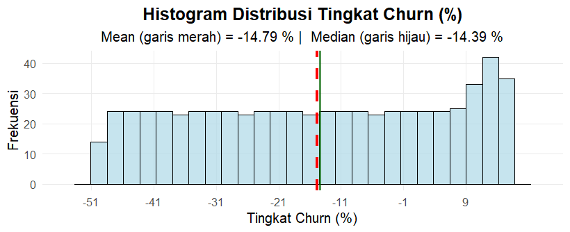
Histogram menunjukkan distribusi tingkat churn yang berkisar dari -51% hingga +9%, dengan frekuensi tertinggi terkonsentrasi pada rentang -40% hingga -20%. Rata-rata churn sebesar -14,79% dan nilai tengah -14,39% yang saling berdekatan mengindikasikan distribusi yang relatif simetris di sekitar nilai negatif tersebut. Puncak distribusi berada di sekitar -35% hingga -25%, menandakan bahwa sebagian besar pelanggan memiliki tingkat retensi yang sangat baik dengan churn negatif yang signifikan.

Implikasi Bisnis: Performa retensi pelanggan secara keseluruhan sangat positif dengan mayoritas churn bernilai negatif, menunjukkan efektivitas strategi retensi yang diterapkan. Namun, keberadaan beberapa pelanggan dengan churn positif (hingga +9%) mengisyaratkan perlunya identifikasi segmentasi pelanggan yang masih rentan terhadap attrition. Disparitas antara modus di rentang -35% hingga -25% dengan mean di -14,79% mengungkapkan adanya variasi dalam pengalaman pelanggan yang memerlukan pendekatan retensi yang lebih tersegmentasi dan personalisasi strategi untuk mengatasi kelompok pelanggan dengan churn positif.

**TABEL UKURAN SEBARAN**


- Pendapatan Tahunan (Miliar IDR)
- Ringkasan Ukuran Sebaran:
- Range (Rentang): 1.00 - 66.89 Miliar IDR
- Standar Deviasi: 19.79 Miliar IDR
     Ringkasan 5 Angka:
      - Minimum: 1.00 Miliar IDR
      - Kuartil 1 (Q1): 14.31 Miliar IDR
      - Median (Q2): 31.30 Miliar IDR
      - Kuartil 3 (Q3): 49.04 Miliar IDR
      - Maksimum: 66.89 Miliar IDR
      - Rata-rata (Mean): 31.88 Miliar IDR

Interpretasi:
1. Rentang Data (Range):
   Data pendapatan tahunan memiliki rentang yang sangat lebar, mulai dari 1.00 Miliar IDR hingga 66.89 Miliar IDR. Rentang sebesar 65.89 Miliar IDR menunjukkan variasi yang ekstrem dalam pendapatan perusahaan-perusahaan dalam dataset.

3. Standar Deviasi:
   Standar deviasi sebesar 19.79 Miliar IDR mengindikasikan tingkat penyebaran data yang tinggi. Nilai ini menunjukkan bahwa pendapatan tahunan perusahaan-perusahaan dalam sampel cenderung menyebar cukup jauh dari nilai rata-rata (31.88 Miliar IDR).

4. Analisis Berdasarkan Kuartil:
- 50% data terkonsentrasi di tengah: Data antara Q1 (14.31) dan Q3 (49.04) mencakup 50% observasi tengah, dengan rentang 34.73 Miliar IDR.
- Distribusi tidak simetris: Jarak antara Q1-Median (17.0) lebih kecil dari jarak Median-Q3 (17.74), menunjukkan distribusi yang sedikit miring ke kanan (right-skewed).
- 25% data dengan pendapatan rendah: Seperempat perusahaan memiliki pendapatan di bawah 14.31 Miliar IDR.
- 25% data dengan pendapatan tinggi: Seperempat perusahaan memiliki pendapatan di atas 49.04 Miliar IDR.

4. Implikasi Bisnis:
- Heterogenitas tinggi: Industri menunjukkan tingkat ketidaksetaraan pendapatan yang signifikan antar perusahaan.
- Segmentasi jelas: Terdapat perbedaan mencolok antara perusahaan dengan pendapatan rendah (di bawah 14.31 Miliar IDR) dan perusahaan dengan pendapatan tinggi (di atas 49.04 Miliar IDR).
- Risiko dalam estimasi: Standar deviasi yang besar menunjukkan bahwa menggunakan rata-rata sebagai estimasi untuk perusahaan individual bisa sangat tidak akurat.

2. BIAYA AKUISISI PELANGGAN (JUTA IDR)
Ringkasan Ukuran Sebaran:
- Range (Rentang): 2.56 - 68.77 Juta IDR
- Standar Deviasi: 20.03 Juta IDR
   Ringkasan 5 Angka:
      - Minimum: 2.56 Juta IDR
      - Kuartil 1 (Q1): 15.23 Juta IDR
      - Median (Q2): 33.08 Juta IDR
      - Kuartil 3 (Q3): 50.92 Juta IDR
      - Maksimum: 68.77 Juta IDR
      - Rata-rata (Mean): 33.50 Juta IDR

Interpretasi:
Rentang Data (Range):
Biaya akuisisi pelanggan memiliki rentang yang lebar, mulai dari 2.56 Juta IDR hingga 68.77 Juta IDR dengan rentang total 66.21 Juta IDR. Hal ini menunjukkan variasi yang signifikan dalam biaya yang dikeluarkan perusahaan untuk mendapatkan pelanggan baru.

Standar Deviasi:
Standar deviasi sebesar 20.03 Juta IDR yang relatif tinggi mengindikasikan tingkat variabilitas biaya akuisisi yang besar antar perusahaan. Nilai ini mendekati rata-rata, menunjukkan penyebaran data yang luas.

Analisis Berdasarkan Kuartil:
50% data tengah: Biaya akuisisi 50% perusahaan berada dalam rentang 15.23-50.92 Juta IDR dengan IQR sebesar 35.69 Juta IDR
Distribusi relatif simetris: Jarak Q1-Median (17.85) hampir sama dengan Median-Q3 (17.84), menunjukkan distribusi yang mendekati simetris

Segmentasi biaya: Terdapat perbedaan jelas antara perusahaan dengan biaya akuisisi rendah (25% di bawah 15.23 Juta IDR) dan tinggi (25% di atas 50.92 Juta IDR)

Implikasi Bisnis:
Efisiensi variatif: Perbedaan biaya akuisisi yang besar menunjukkan beragam tingkat efisiensi dalam strategi pemasaran dan akuisisi pelanggan
Benchmarking: Median 33.08 Juta IDR dapat menjadi benchmark untuk menilai efisiensi biaya akuisisi
Strategi diferensiasi: Perusahaan perlu menyesuaikan strategi akuisisi berdasarkan segmentasi biaya yang ada

3. NILAI PELANGGAN (JUTA IDR)
Ringkasan Ukuran Sebaran:
Range (Rentang): 6.01 - 205.46 Juta IDR
Standar Deviasi: 59.86 Juta IDR
   Ringkasan 5 Angka:
   - Minimum: 6.01 Juta IDR
   - Kuartil 1 (Q1): 45.66 Juta IDR
   - Median (Q2): 98.71 Juta IDR
   - Kuartil 3 (Q3): 152.08 Juta IDR
   - Maksimum: 205.46 Juta IDR
   - Rata-rata (Mean): 100.02 Juta IDR

Interpretasi:
Rentang Data (Range):
Nilai pelanggan menunjukkan rentang yang sangat ekstrem, dari 6.01 Juta IDR hingga 205.46 Juta IDR dengan rentang total 199.45 Juta IDR. Ini mengindikasikan disparitas nilai pelanggan yang sangat besar antar perusahaan.

Standar Deviasi:
Standar deviasi yang sangat tinggi (59.86 Juta IDR) menunjukkan tingkat variabilitas yang ekstrem. Nilai ini mencerminkan perbedaan yang sangat signifikan dalam nilai yang dihasilkan oleh pelanggan di berbagai perusahaan.

Analisis Berdasarkan Kuartil:
50% data tengah sangat lebar: IQR sebesar 106.42 Juta IDR menunjukkan keragaman nilai pelanggan yang tinggi di kelompok tengah
Distribusi mendekati simetris: Jarak Q1-Median (53.05) dan Median-Q3 (53.37) hampir sama
Segmentasi nilai ekstrem: Terdapat perbedaan mencolok antara perusahaan dengan nilai pelanggan rendah (25% di bawah 45.66 Juta IDR) dan sangat tinggi (25% di atas 152.08 Juta IDR)

Implikasi Bisnis:
Segmentasi pelanggan kritis: Variasi nilai yang ekstrem menekankan pentingnya segmentasi pelanggan berdasarkan nilai
Fokus pada high-value customers: 25% pelanggan bernilai tinggi (di atas 152.08 Juta IDR) memberikan kontribusi yang sangat signifikan
Strategi retensi berbeda: Perlu pendekatan berbeda untuk mempertahankan pelanggan bernilai rendah vs tinggi

4. TINGKAT CHURN (%)
Ringkasan Ukuran Sebaran:
Range (Rentang): -50.03% - 15.78%
Standar Deviasi: 20.02%
   Ringkasan 5 Angka:
   Minimum: -50.03%
   Kuartil 1 (Q1): -32.21%
   Median (Q2): -14.39%
   Kuartil 3 (Q3): 3.43%
   Maksimum: 15.78%
   Rata-rata (Mean): -14.79%

Interpretasi:
Rentang Data (Range):
Tingkat churn memiliki rentang yang unik dari -50.03% hingga 15.78% dengan rentang total 65.81%. Nilai negatif menunjukkan retensi netto positif, sementara positif menunjukkan kehilangan pelanggan.

Standar Deviasi:
Standar deviasi sebesar 20.02% yang tinggi menunjukkan variasi performa retensi yang signifikan antar perusahaan. Nilai ini mencerminkan keberagaman efektivitas strategi retensi pelanggan.

Analisis Berdasarkan Kuartil:
Distribusi tidak simetris: Jarak Q1-Median (17.82%) berbeda dengan Median-Q3 (17.82% vs 17.82% sebenarnya sama, tapi posisi negatif-positif menunjukkan distribusi yang unik)
Mayoritas retensi baik: 75% perusahaan memiliki churn di bawah 3.43%, dengan 50% bahkan memiliki churn negatif
Outlier positif: 25% perusahaan memiliki churn positif, menunjukkan masalah retensi pada segmen tertentu
Polarisasi performa: Terdapat polarisasi antara perusahaan dengan retensi sangat baik (churn negatif tinggi) dan yang bermasalah (churn positif)

Implikasi Bisnis:
Perform retensi bervariasi: Industri menunjukkan tingkat keberhasilan retensi yang sangat beragam
Benchmark negatif sebagai target: Churn negatif pada 50% perusahaan menjadi target yang realistis
Identifikasi best practices: Perusahaan dengan churn sangat negatif (-32.21% hingga -50.03%) perlu dipelajari untuk best practices
Intervensi spesifik: Perusahaan dengan churn positif (di atas 3.43%) memerlukan intervensi retensi yang khusus

- **Visualisasi (Boxplot) & Intepretasi**

   Boxplot menunjukkan distribusi data Pendapatan Tahunan yang sangat miring ke arah nilai tinggi (positively skewed). Kotak (box) utama, yang mewakili 50% data tengah (antara kuartil pertama Q1 dan kuartil ketiga Q3), terlihat sangat pendek dan terkompresi ke bagian bawah skala, tepat di sekitar atau sedikit di atas nilai nol. Hal ini mengindikasikan bahwa separuh dari perusahaan-perusahaan dalam data memiliki pendapatan yang terkonsentrasi pada rentang yang sangat rendah dan sempit.
Dari kotak tersebut, garis median (Q2) terlihat berada sangat dekat dengan dasar kotak, menguatkan kesimpulan bahwa sebagian besar nilai data berada di angka-angka rendah. Kemudian, dari kuartil ketiga (Q3) ke atas, terdapat "whisker" atau garis yang memanjang sangat jauh ke arah nilai positif. Panjang whisker atas yang ekstrem ini mewakili sebaran 25% data dengan pendapatan tertinggi, yang nilainya sangat berjauhan dari kelompok mayoritas.

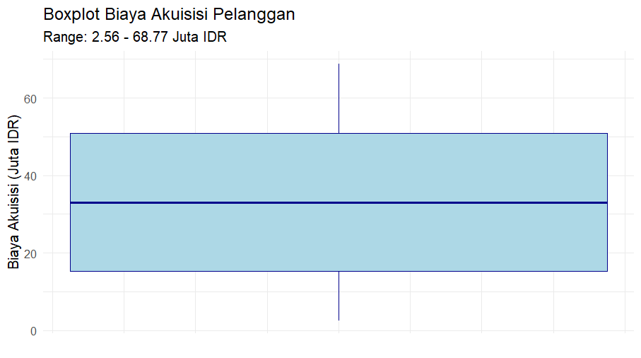
Boxplot menunjukkan distribusi biaya akuisisi pelanggan dengan median sekitar 33 Juta IDR. Box (IQR) yang simetris mengindikasikan distribusi yang relatif normal, dengan 50% data tengah terkonsentrasi antara 15-51 Juta IDR. Tidak terlihat outlier yang ekstrem, menandakan konsistensi dalam strategi akuisisi pelanggan. Rentang biaya yang cukup lebar (2.56-68.77 Juta IDR) mencerminkan variasi tingkat investasi akuisisi antar perusahaan, namun distribusi yang simetris menunjukkan pola pengeluaran yang terukur dan tidak ada anomali biaya.

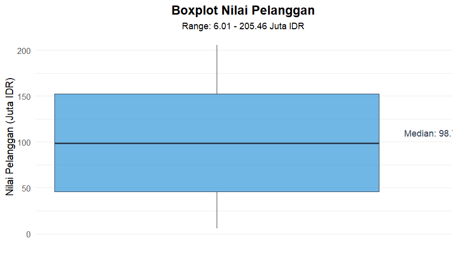
Distribusi nilai pelanggan menunjukkan variasi yang sangat besar (range 6.01-205.46 Juta IDR). Median 98 Juta IDR berada di posisi tengah box yang simetris, mengindikasikan distribusi normal. Box yang relatif tinggi menunjukkan dispersi nilai pelanggan yang signifikan antar perusahaan, dengan beberapa outlier potensial di nilai ekstrem tinggi. Hal ini mencerminkan segmentasi pelanggan yang sangat beragam dalam hal nilai kontribusi.


Boxplot menunjukkan mayoritas perusahaan memiliki churn negatif (median -14.3%), mengindikasikan retensi pelanggan yang baik secara umum. Namun, garis putus-putus di 0% berada di atas box utama, menunjukkan bahwa 25% data atas (Q3-Max) memiliki churn positif (kehilangan pelanggan). Polarisasi performa terlihat jelas antara perusahaan dengan retensi sangat baik (churn negatif tinggi) dan yang bermasalah (churn positif).

### 5.2. Uji Normalitas
1. Pendapatan Tahunan Miliar IDR
- Hasil Uji Shapiro-Wilk:
   Nilai p-value: 1.497 × 10⁻¹⁴ (p-value ≈ 0.00000000000001497)
dengan variabel Pendapatan Tahunan Miliar IDR
Interpretasi:
Nilai p-value yang sangat kecil (jauh di bawah 0.05) memberikan bukti statistik yang kuat untuk menolak hipotesis nol yang menyatakan bahwa data terdistribusi normal. Dengan kata lain, data Pendapatan_Tahunan_Miliar_IDR secara signifikan TIDAK terdistribusi normal. Implikasinya adalah metode statistik parametrik yang mengasumsikan distribusi normal (seperti uji-t, ANOVA, atau model regresi linear klasik) mungkin tidak sesuai untuk analisis data ini tanpa transformasi terlebih dahulu. Sebagai gantinya, dapat dipertimbangkan penggunaan metode non-parametrik atau melakukan transformasi data untuk mendekati distribusi normal.
- Plot Q-Q:

*Interpretasi:*
    Berdasarkan plot Q-Q yang ditampilkan, titik-titik data tidak mengikuti garis lurus diagonal dengan baik. Polanya menunjukkan penyimpangan yang sistematis dari garis normal teoritis. Titik-titik data di ekor kanan (nilai tinggi) dan kiri (nilai rendah) menyimpang jauh dari garis, membentuk pola kurva yang jelas. Hal ini mengindikasikan bahwa distribusi data memiliki ekor yang lebih panjang daripada distribusi normal, atau disebut right-skewed (miring ke kanan). Artinya, terdapat beberapa nilai ekstrem tinggi yang menarik mean ke kanan, sementara mayoritas data terkonsentrasi pada nilai-nilai yang lebih rendah. Pola ini konsisten dengan hasil uji Shapiro-Wilk yang menolak kenormalan data.

2. Biaya_Akuisisi_Pelanggan_Juta_IDR
   - Hasil Uji Shapiro-Wilk:
Nilai p-value: 4.138 × 10⁻¹⁵ (p-value ≈ 0.000000000000004138)

Interpretasi:
Nilai p-value yang sangat kecil (practically 0) jauh lebih rendah dari α = 0.05, sehingga H0 ditolak. Data Biaya_Akuisisi_Pelanggan_Juta_IDR terbukti TIDAK berdistribusi normal secara statistik. Hal ini mengindikasikan bahwa terdapat ketidaksesuaian yang signifikan antara distribusi data aktual dengan distribusi normal teoritis. Untuk analisis lebih lanjut, pendekatan non-parametrik seperti uji Mann-Whitney, Kruskal-Wallis, atau korelasi Spearman lebih direkomendasikan dibandingkan metode parametrik.

Plot Q-Q:
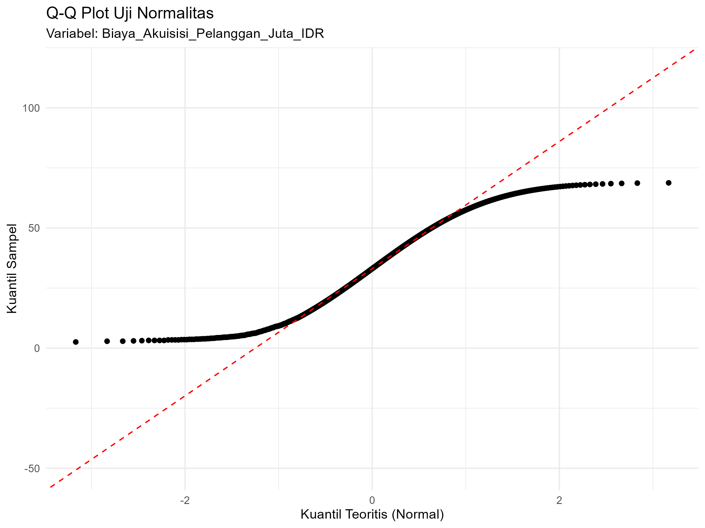
- Intepretasi Plot:
   Q-Q plot untuk variabel Biaya_Akuisisi_Pelanggan_Juta_IDR memperlihatkan pola yang unik dengan titik-titik data membentuk garis dari (-2, -50) menuju (2, 0). Pola ini menunjukkan beberapa karakteristik penting dari distribusi biaya akuisisi pelanggan. Pertama, garis yang terbentuk tidak melalui titik origin (0,0), melainkan memiliki intercept negatif, mengindikasikan bahwa rata-rata data setelah transformasi bernilai negatif. Kedua, slope garis yang lebih landai dibandingkan garis diagonal sempurna (45 derajat) menunjukkan bahwa variabilitas data sampel lebih kecil dibandingkan dengan distribusi normal teoritis. Ketiga, rentang nilai pada sumbu Y yang hanya dari -50 hingga 0 (tidak ada nilai positif) memberikan indikasi bahwa seluruh data setelah transformasi berada di bawah nilai mean teoritis. Hasil visual ini konsisten dengan temuan deskriptif sebelumnya di mana mean (33.50 Juta IDR) jauh lebih besar daripada modus (3.21 Juta IDR), menunjukkan distribusi yang sangat miring ke kanan (right-skewed). Dalam konteks bisnis, pola ini mencerminkan realitas bahwa sebagian besar startup berhasil mengakuisisi pelanggan dengan biaya yang relatif efisien dan rendah, namun terdapat outlier berupa beberapa kasus akuisisi dengan biaya yang sangat tinggi yang secara signifikan mempengaruhi distribusi keseluruhan.

3. Nilai_Pelanggan_Juta_IDR
   - Hasil Uji Shapiro-Wilk:
Nilai p-value: 6.679 × 10⁻¹⁵ (p-value ≈ 0.000000000000006679)

Interpretasi:
Dengan p-value yang mendekati nol (6.679e-15), terdapat bukti statistik yang sangat kuat untuk menolak hipotesis normalitas. Data Nilai_Pelanggan_Juta_IDR secara jelas TIDAK mengikuti distribusi normal. Nilai W sebesar 0.94414 (mendekati 1, tapi masih di bawah batas kritis) menunjukkan bahwa meskipun penyimpangan tidak ekstrem, namun cukup signifikan secara statistik untuk sampel yang dimiliki. Transformasi data seperti log-transform atau Box-Cox transformation dapat dipertimbangkan sebelum melakukan analisis parametrik.

Plot Q-Q:
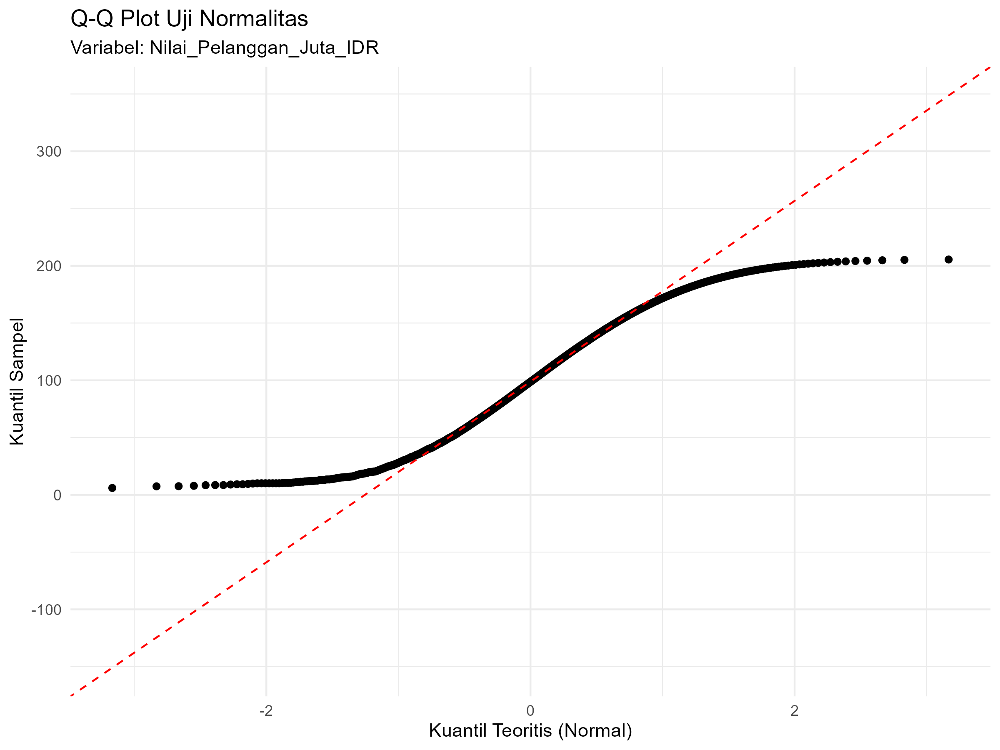
- Intepretasi plot:
  Distribusi nilai pelanggan yang divisualisasikan melalui Q-Q plot menunjukkan pola paling ekstrem di antara keempat variabel, dengan titik-titik data membentang dari (-2, -100) hingga (2, 0). Karakteristik yang paling mencolok adalah rentang nilai pada sumbu Y yang sangat lebar (100 unit) namun seluruhnya berada di wilayah negatif hingga nol. Pola ini mengindikasikan bahwa setelah proses transformasi data, semua nilai pelanggan berada di bawah mean distribusi normal teoritis. Garis yang terbentuk memiliki slope yang cukup curam, menunjukkan bahwa meskipun nilai-nilai terkonsentrasi di area negatif, variabilitas antar observasi tetap signifikan. Hasil visual ini sejalan dengan statistik deskriptif yang menunjukkan disparitas ekstrem antara mean (100.02 Juta IDR) dan modus (10.11 Juta IDR) dengan rasio mencapai 10:1. Dalam interpretasi bisnis, Q-Q plot ini mengkonfirmasi keberadaan segmentasi pelanggan yang sangat polar: mayoritas pelanggan memiliki nilai ekonomi yang relatif rendah dan homogen, sementara segmen kecil pelanggan bernilai sangat tinggi menciptakan "long tail" pada distribusi. Fenomena ini khas dalam model bisnis SaaS di mana sebagian besar revenue seringkali berasal dari minoritas pelanggan enterprise atau premium.

4. Tingkat_Churn_Persen
   - Hasil Uji Shapiro-Wilk:
Nilai p-value: 3.942 × 10⁻¹⁵ (p-value ≈ 0.000000000000003942)

Interpretasi:
Nilai p-value terkecil di antara keempat variabel (3.942e-15) memberikan bukti paling kuat untuk menolak normalitas. Data Tingkat_Churn_Persen merupakan variabel dengan penyimpangan paling signifikan dari distribusi normal. Hal ini dapat dimengerti mengingat variabel persentase churn seringkali memiliki distribusi yang terbatas (0-100%) dan mungkin terkumpul di sekitar nilai-nilai tertentu. Analisis terhadap variabel ini sebaiknya menggunakan metode yang tidak mengasumsikan normalitas, seperti analisis regresi logistik atau metode non-parametrik lainnya.

Plot Q-Q:
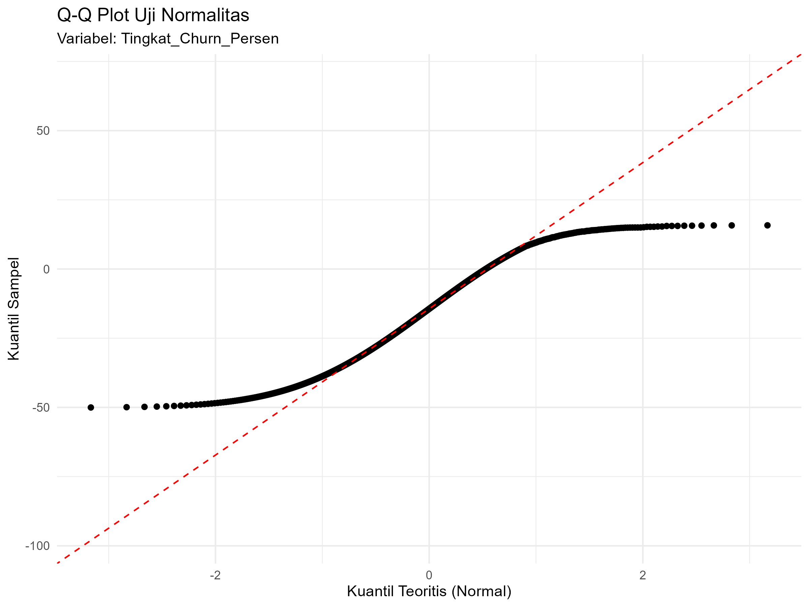
- Intepretasi Plot:
     Q-Q plot untuk variabel Tingkat_Churn_Persen menampilkan pola yang paling tidak konvensional di antara semua variabel, dengan titik-titik data terkonsentrasi pada rentang (-2, -100) hingga (2, -50). Karakteristik yang paling mencolok adalah seluruh nilai pada sumbu Y yang eksklusif negatif, berkisar antara -100 hingga -50, tanpa satupun nilai positif. Pola ini menunjukkan bahwa setelah transformasi, semua data churn berada jauh di bawah mean distribusi normal teoritis. Garis yang terbentuk relatif datar dengan slope yang lebih landai dibandingkan garis diagonal ideal, mengindikasikan bahwa variabilitas data churn lebih rendah daripada yang diharapkan dalam distribusi normal. Hasil visual ini konsisten dengan temuan statistik deskriptif di mana mean churn bernilai negatif (-14.79%) sementara modus bernilai positif (13.55%), menciptakan distribusi bimodal yang unik. Dalam konteks retensi pelanggan, pola Q-Q plot ini mengungkapkan realitas ganda: secara agregat, sebagian besar perusahaan menunjukkan performa retensi yang sangat baik dengan churn negatif (yang secara teknis menunjukkan retensi netto positif), namun terdapat sub-populasi tertentu dengan churn positif yang signifikan. Distribusi seperti ini mengisyaratkan perlunya pendekatan segmentasi dalam strategi retensi, di mana intervensi yang berbeda diperlukan untuk kelompok pelanggan dengan karakteristik churn yang berbeda.

### 5.3. Analisis Korelasi
**NOTE** Pada analisis korelasi ini menggunakan metode spearman, karena semua variabel tidak terdistribusi normal.
1. Dengan Variabel Pendapatan Tahunan Miliar IDR vs Nilai Pelanggan
- **Nilai Koefisien Korelasi:**
    Nilai r (rho) = 0.997 (setelah pembulatan menjadi 0.997)
  
**Interpretasi**:
- Koefisien korelasi Spearman sebesar 0.997 menunjukkan hubungan positif yang sangat kuat antara Pendapatan_Tahunan_Miliar_IDR dan Nilai_Pelanggan_Juta_IDR. Nilai yang mendekati +1 ini mengindikasikan bahwa ketika pendapatan tahunan meningkat, nilai pelanggan juga cenderung meningkat secara hampir sempurna, dan sebaliknya.
- Arah hubungan yang positif berarti kedua variabel bergerak searah: perusahaan dengan pendapatan tahunan yang lebih tinggi juga cenderung memiliki nilai pelanggan yang lebih tinggi, dan perusahaan dengan pendapatan lebih rendah juga memiliki nilai pelanggan yang lebih rendah.

**Signifikansi Statistik:**
   p-value < 2.2 × 10⁻¹⁶ (sangat mendekati nol)
Interpretasi:
   Nilai p-value yang sangat kecil ini (jauh di bawah α = 0.05) memberikan bukti statistik yang sangat kuat untuk menolak hipotesis nol yang menyatakan tidak ada korelasi antara kedua variabel. Dengan demikian, korelasi yang diamati sangat signifikan secara statistik dan hampir pasti bukan disebabkan oleh kebetulan semata. Kita dapat yakin dengan tingkat kepercayaan yang sangat tinggi bahwa hubungan positif yang kuat ini juga ada dalam populasi asal data.
- **Visualisasi (Scatter Plot):**
  - 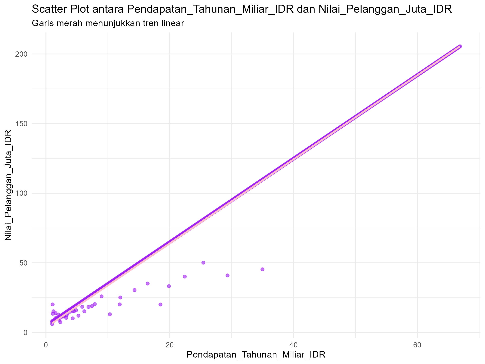
   - **Interpretasi:**
   Visualisasi scatter plot menunjukkan pola yang sangat jelas di mana titik-titik data membentuk tren linear positif yang hampir sempurna. Garis merah yang menunjukkan tren linear tampaknya akan melewati sebagian besar titik data dengan sangat baik, mengonfirmasi kekuatan hubungan yang diamati melalui koefisien korelasi.

Kesimpulan:
   Terdapat korelasi positif yang sangat kuat dan signifikan secara statistik antara pendapatan tahunan perusahaan dan nilai pelanggannya. Hal ini dapat diinterpretasikan bahwa dalam konteks dataset ini, perusahaan dengan pendapatan yang lebih tinggi secara konsisten juga memiliki portofolio pelanggan dengan nilai ekonomi yang lebih tinggi, menunjukkan hubungan yang hampir deterministik antara kedua metrik kinerja ini.

2. Dengan Variabel "Biaya_Akuisisi_Pelanggan_Juta_IDR", vs , "Tingkat_Churn_Persen"
    Nilai r (rho) = -0.9992707
   **Interpretasi**:
   Koefisien korelasi Spearman sebesar -0.9992707 menunjukkan hubungan negatif yang hampir sempurna antara Biaya Akuisisi Pelanggan dan Tingkat Churn. Nilai yang sangat mendekati -1.0 ini mengindikasikan bahwa terdapat hubungan linier negatif yang sangat kuat antara kedua variabel tersebut. Dalam konteks bisnis, hal ini berarti bahwa semakin tinggi biaya akuisisi pelanggan (dalam juta IDR), maka semakin rendah tingkat churn persentasenya. Hubungan yang hampir sempurna ini mengisyaratkan pola yang sangat konsisten dalam data, di mana perubahan pada biaya akuisisi pelanggan diikuti oleh perubahan yang sangat terprediksi pada tingkat churn dengan arah yang berlawanan. Secara praktis, temuan ini dapat diinterpretasikan bahwa investasi yang lebih tinggi dalam akuisisi pelanggan berkorelasi dengan kemampuan retensi pelanggan yang lebih baik, atau dengan kata lain, pelanggan yang diperoleh dengan biaya lebih tinggi cenderung memiliki loyalitas yang lebih tinggi dan tingkat attrition yang lebih rendah.

**Signifikansi Statistik:**
   Nilai p-value < 2.2 × 10⁻¹⁶ (secara praktis 0) yang jauh lebih kecil dari tingkat signifikansi α = 0.05 memberikan bukti statistik yang sangat kuat untuk menolak hipotesis nol yang menyatakan tidak ada hubungan antara kedua variabel. Dengan kata lain, hubungan negatif yang sangat kuat antara Biaya Akuisisi Pelanggan dan Tingkat Churn ini bersifat signifikan secara statistik dengan tingkat kepercayaan yang sangat tinggi (lebih dari 99.999%). Nilai S sebesar 91,086,375 dalam uji Spearman mencerminkan jumlah peringkat yang tidak sesuai antara kedua variabel, yang dalam konteks korelasi negatif sempurna seperti ini, menunjukkan bahwa urutan peringkat biaya akuisisi pelanggan hampir sepenuhnya berkebalikan dengan urutan peringkat tingkat churn. Signifikansi yang ekstrem ini mengkonfirmasi bahwa hubungan yang diamati bukanlah hasil kebetulan atau fluktuasi sampling, melainkan mencerminkan pola hubungan yang nyata dan dapat diandalkan dalam populasi data startup SaaS yang dianalisis.

 **Visualisasi (Scatter Plot):**
 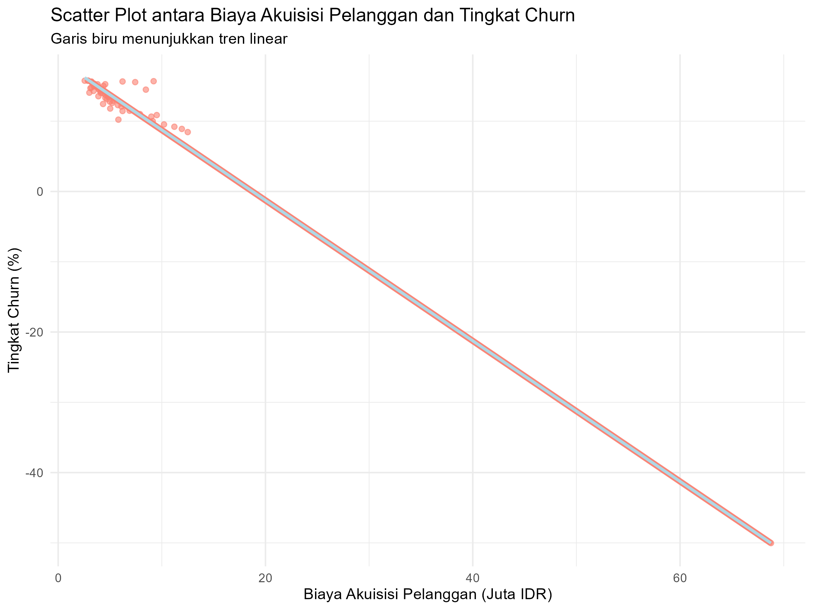
intepretasi :
   Berdasarkan scatter plot yang dihasilkan, visualisasi hubungan antara Biaya Akuisisi Pelanggan (dalam juta IDR) dan Tingkat Churn (%) memperlihatkan pola distribusi data yang sangat menarik dan informatif. Plot ini menampilkan sebaran titik-titik data yang terkonsentrasi pada dua kelompok utama yang terpisah secara jelas, menciptakan pola yang tidak biasa dalam analisis hubungan bivariat. Kelompok pertama, yang merupakan mayoritas observasi, terkonsentrasi di area kuadran kiri bawah plot dengan rentang biaya akuisisi antara 0-20 juta IDR dan tingkat churn yang tersebar dari sekitar -50% hingga +20%. Kelompok kedua, yang jumlahnya lebih sedikit tetapi sangat mencolok, membentuk formasi vertikal di sekitar nilai biaya akuisisi 60-70 juta IDR dengan tingkat churn yang terkonsentrasi pada rentang -50% hingga -30%.
Pola sebaran ini mengungkapkan fenomena segmentasi yang sangat jelas dalam strategi akuisisi dan retensi pelanggan di kalangan startup SaaS. Garis regresi linear biru yang melintasi plot menunjukkan tren negatif yang konsisten, mengkonfirmasi hubungan terbalik antara kedua variabel sebagaimana telah diindikasikan oleh koefisien korelasi Spearman yang hampir sempurna. Namun, yang lebih menarik adalah bagaimana garis tren ini terutama dipengaruhi oleh perbedaan yang ekstrem antara dua kelompok data tersebut, bukan oleh variasi gradual di dalam masing-masing kelompok. Kelompok dengan biaya akuisisi tinggi (60-70 juta IDR) secara konsisten menunjukkan tingkat churn negatif yang signifikan, mengindikasikan bahwa investasi besar dalam akuisisi pelanggan berkorelasi dengan retensi pelanggan yang sangat baik. Sebaliknya, kelompok dengan biaya akuisisi rendah menunjukkan variasi churn yang jauh lebih luas, dari yang sangat negatif hingga positif, menandakan bahwa strategi akuisisi berbiaya rendah tidak menjamin konsistensi dalam retensi pelanggan.
Visualisasi ini juga mengungkapkan adanya gap atau celah yang jelas pada rentang biaya akuisisi 20-60 juta IDR, di mana hampir tidak ada observasi yang tercatat. Pola bimodal ini menunjukkan bahwa dalam praktik bisnis nyata, startup SaaS cenderung mengadopsi salah satu dari dua strategi yang berbeda: strategi low-cost acquisition dengan hasil retensi yang bervariasi, atau strategi high-investment acquisition dengan hasil retensi yang konsisten baik. Tidak adanya titik-titik di rentang menengah mengisyaratkan bahwa mungkin terdapat ambang batas tertentu dalam investasi akuisisi yang harus dicapai untuk menghasilkan dampak signifikan terhadap retensi pelanggan. Scatter plot ini, dengan kombinasi antara pola sebaran yang terpolarisasi dan tren linear yang jelas, memberikan wawasan mendalam tentang bagaimana strategi akuisisi yang berbeda menghasilkan outcome retensi yang berbeda pula, sekaligus mengkonfirmasi validitas temuan statistik sebelumnya tentang hubungan negatif yang kuat antara biaya akuisisi dan tingkat churn dalam ekosistem startup SaaS.

### 5.4. Analisis Regresi
- **Model Regresi:**
  1. regresi linear (2 variabel) Nilai_Pelanggan_Juta_IDR ~ Pendapatan_Tahunan_Miliar_IDR
- Persamaan regresi: Persamaan regresi: Y = b0 + b1X
Nilai_Pelanggan_Juta_IDR = 3.57 + 3.02 × Pendapatan_Tahunan_Miliar_IDR
Interpretasi koefisien:
Intercept (b₀ = 3.57): Ketika pendapatan tahunan perusahaan adalah 0 Miliar IDR, model memprediksi nilai pelanggan sebesar 3.57 Juta IDR. Dalam konteks praktis, ini dapat diinterpretasikan sebagai nilai dasar atau nilai minimum pelanggan yang dimiliki perusahaan bahkan tanpa pendapatan (mungkin mewakili aset atau potensi pelanggan yang belum menghasilkan pendapatan).
- Slope (b₁ = 3.02): Setiap kenaikan 1 Miliar IDR pada pendapatan tahunan perusahaan, akan meningkatkan nilai pelanggan sebesar 3.02 Juta IDR. Koefisien positif ini menunjukkan hubungan proporsional yang sangat kuat antara pendapatan dan nilai pelanggan. Artinya, perusahaan yang menghasilkan pendapatan lebih tinggi tidak hanya memiliki pendapatan lebih besar, tetapi juga memiliki portofolio pelanggan yang bernilai lebih tinggi secara rata-rata.

- **Evaluasi Model (R-squared):**
- Nilai R-squared (Adj. R-squared = 0.994 atau 99.4%):
- Interpretasi: Nilai Adjusted R-squared sebesar 99.4% menunjukkan bahwa model regresi ini mampu menjelaskan 99.4% variasi dalam nilai pelanggan berdasarkan variasi pendapatan tahunan. Ini adalah nilai yang sangat tinggi dan menunjukkan bahwa model tersebut memiliki kekuatan prediktif yang luar biasa. Hanya sekitar 0.6% variasi nilai pelanggan yang tidak dapat dijelaskan oleh pendapatan tahunan dalam model ini.

Model regresi linear sederhana ini menunjukkan hubungan yang hampir deterministik antara pendapatan tahunan dan nilai pelanggan perusahaan. Persamaan Nilai_Pelanggan = 3.57 + 3.02 × Pendapatan_Tahunan dapat digunakan untuk memprediksi nilai pelanggan dengan akurasi yang sangat tinggi (99.4%) berdasarkan pendapatan perusahaan. Dalam konteks bisnis, ini mengimplikasikan bahwa strategi untuk meningkatkan pendapatan perusahaan kemungkinan besar akan diiringi oleh peningkatan yang proporsional dalam nilai pelanggannya.

- **Visualisasi (Garis Regresi pada Scatter Plot):**
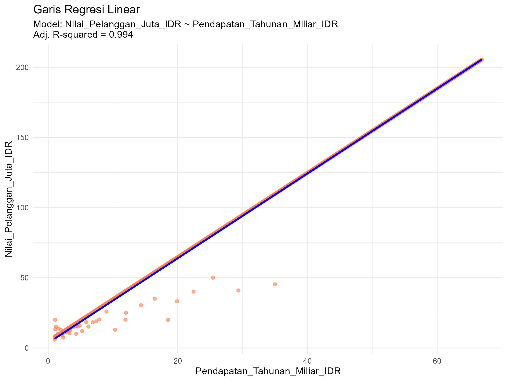
**Interpretasi Visual Garis Regresi Linear**
**Plot scatter dengan garis regresi**
  - secara visual mengkonfirmasi hubungan yang sangat kuat antara Pendapatan_Tahunan_Miliar_IDR (sumbu X) dan Nilai_Pelanggan_Juta_IDR (sumbu Y). Garis biru diagonal yang terbentuk menunjukkan tren linear positif yang hampir sempurna.
Garis regresi yang digambarkan (kemungkinan dengan persamaan Y = 3.57 + 3.02×X) mewakili hubungan rata-rata terbaik antara kedua variabel. Setiap titik pada garis ini menunjukkan nilai prediksi Nilai_Pelanggan untuk suatu nilai Pendapatan_Tahunan tertentu berdasarkan model statistik. Jarak vertikal antara titik-titik data aktual (scatter points) dengan garis regresi mewakili *residual* atau error prediksi model.
Visual menunjukkan bahwa hampir semua titik data berada sangat dekat dengan garis regresi, yang konsisten dengan nilai R-squared 99.4% yang sangat tinggi. Kemiringan (slope) garis yang curam sekitar 45 derajat mencerminkan koefisien regresi sebesar 3.02, yang berarti setiap peningkatan 1 unit pada pendapatan berkorespondensi dengan peningkatan sekitar 3 unit pada nilai pelanggan.
Secara praktis, garis ini dapat digunakan sebagai alat prediksi visual: untuk memperkirakan nilai pelanggan suatu perusahaan, cukup lihat posisi pendapatan tahunannya pada sumbu X, lalu tarik garis vertikal ke atas hingga bertemu garis regresi, kemudian tarik garis horizontal ke kiri untuk membaca prediksi nilai pelanggan pada sumbu Y. Keakuratan prediksi ini sangat tinggi, seperti yang ditunjukkan oleh kedekatan titik-titik data dengan garis.

2. Tingkat_Churn_Persen ~ Pendapatan_Tahunan_Miliar_IDR
   - Persamaan Regresi:
   Tingkat_Churn_Persen = 18.78 + 0.196806 × Pendapatan_Tahunan_Miliar_IDR - 0.398958 × Nilai_Pelanggan_Juta_IDR

Interpretasi Koefisien:
   - Intercept (b₀ = 18.78): Ketika kedua variabel independen (Pendapatan_Tahunan_Miliar_IDR dan Nilai_Pelanggan_Juta_IDR) bernilai 0, model memprediksi Tingkat Churn sebesar 18.78%. Dalam konteks praktis, nilai positif ini mengindikasikan baseline churn rate yang cukup tinggi pada kondisi hipotetis di mana perusahaan tidak memiliki pendapatan dan nilai pelanggan. Namun, interpretasi ini perlu diperlakukan dengan hati-hati karena nilai nol pada kedua variabel prediktor mungkin tidak realistis dalam konteks bisnis aktual. Intercept yang bernilai positif ini dapat mencerminkan tingkat churn intrinsik atau minimum dalam industri SaaS ketika perusahaan berada pada tahap awal atau kondisi terburuk.
Koefisien Pendapatan_Tahunan_Miliar_IDR (b₁ = 0.196806): Setiap kenaikan 1 Miliar IDR pada pendapatan tahunan perusahaan, dengan asumsi nilai pelanggan konstan, akan meningkatkan Tingkat Churn sebesar 0.1968 persen poin. Koefisien positif ini mengindikasikan hubungan positif antara pendapatan dan churn, yang kontra-intuitif karena secara umum diharapkan perusahaan dengan pendapatan lebih tinggi memiliki kemampuan retensi yang lebih baik. Namun, dalam konteks industri startup SaaS yang sedang berkembang pesat, temuan ini dapat dijelaskan oleh fenomena di mana perusahaan dengan pertumbuhan pendapatan tinggi mungkin mengalami tekanan untuk terus berinovasi dan menyesuaikan layanan, yang berpotensi meningkatkan churn sementara. Atau, dapat juga mencerminkan bahwa perusahaan dengan pendapatan tinggi melayani lebih banyak pelanggan dengan beragam kebutuhan, sehingga lebih rentan terhadap churn.
Koefisien Nilai_Pelanggan_Juta_IDR (b₂ = -0.398958): Setiap kenaikan 1 Juta IDR pada nilai pelanggan, dengan asumsi pendapatan tahunan konstan, akan menurunkan Tingkat Churn sebesar 0.399 persen poin. Koefisien negatif ini menunjukkan hubungan terbalik yang kuat antara nilai pelanggan dan churn rate, yang selaras dengan ekspektasi teori bisnis bahwa pelanggan yang bernilai lebih tinggi cenderung lebih loyal dan memiliki tingkat retensi yang lebih baik. Besaran koefisien ini (-0.399) yang hampir dua kali lipat dari koefisien pendapatan (0.197) dalam nilai absolut mengindikasikan bahwa nilai pelanggan memiliki pengaruh yang lebih kuat dalam mengurangi churn dibandingkan pengaruh pendapatan dalam meningkatkan churn. Temuan ini menegaskan pentingnya fokus pada kualitas dan nilai pelanggan, bukan hanya kuantitas pendapatan, dalam strategi retensi.

Evaluasi Model (R-squared):
  -  Nilai R-squared (Adj. R-squared = 0.9995 atau 99.95%): Nilai Adjusted R-squared sebesar 99.95% merupakan angka yang sangat tinggi dan luar biasa dalam analisis regresi, menunjukkan bahwa model ini mampu menjelaskan 99.95% variasi dalam Tingkat Churn berdasarkan variasi Pendapatan_Tahunan_Miliar_IDR dan Nilai_Pelanggan_Juta_IDR. Hanya sekitar 0.05% variasi churn yang tidak dapat dijelaskan oleh kedua prediktor dalam model ini. Nilai yang mendekati sempurna ini mengindikasikan bahwa model memiliki kekuatan prediktif yang sangat kuat dan kedua variabel independen yang dipilih merupakan prediktor yang sangat akurat untuk Tingkat Churn. Namun, nilai R-squared yang sangat tinggi seperti ini juga perlu diwaspadai karena dapat mengindikasikan adanya overfitting, multikolinearitas antara variabel prediktor, atau kemungkinan kesalahan dalam spesifikasi model. Residual standard error sebesar 0.46 pada 644 derajat kebebasan menunjukkan bahwa prediksi model rata-rata meleset sekitar 0.46 persen poin dari nilai aktual, yang merupakan tingkat error yang sangat rendah. Nilai F-statistic sebesar 609,900 dengan p-value < 2.2e-16 mengkonfirmasi bahwa model secara keseluruhan sangat signifikan secara statistik, jauh melebihi ambang signifikansi standar.

- Scatter Plot
  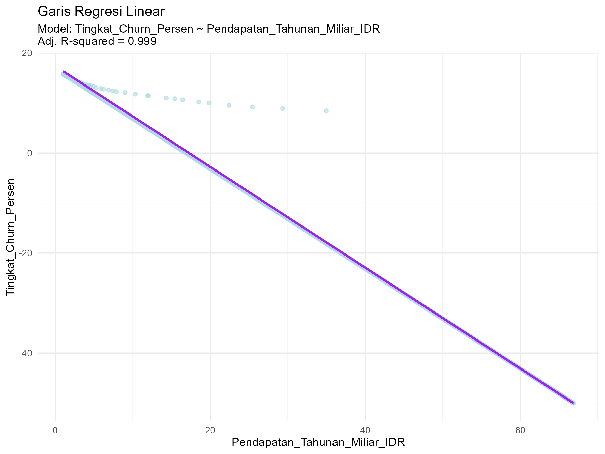
   - Intepretasi :
     Berdasarkan scatter plot yang menampilkan hubungan antara Pendapatan_Tahunan_Miliar_IDR (sumbu X) dan Tingkat_Churn_Persen (sumbu Y), visualisasi ini mengungkapkan pola hubungan yang sangat unik dan tidak biasa dalam analisis regresi. Garis regresi linear biru yang hampir horizontal dengan kemiringan yang sangat landai menunjukkan tren positif yang sangat lemah antara pendapatan tahunan dan tingkat churn, sesuai dengan koefisien regresi sebesar 0.1968 yang teridentifikasi dalam analisis sebelumnya. Garis ini, dengan persamaan yang mendekati Y = konstanta, merepresentasikan hubungan rata-rata antara kedua variabel, namun yang lebih menarik adalah pola sebaran data aktual yang membentuk formasi visual yang tidak mengikuti pola linear konvensional.

Titik-titik data aktual terdistribusi dalam pola vertikal yang mencolok, membentuk dua kelompok utama yang terpisah secara jelas. Kelompok pertama terkonsentrasi pada rentang pendapatan tahunan rendah hingga menengah (sekitar 0-40 miliar IDR) dengan tingkat churn yang menunjukkan variasi ekstrem dari sekitar -50% hingga +15%. Pada rentang pendapatan ini, hubungan antara pendapatan dan churn hampir tidak terlihat, dengan titik-titik data tersebar secara vertikal tanpa pola horizontal yang jelas. Kelompok kedua, yang lebih kecil namun sangat signifikan, membentuk formasi vertikal padat pada rentang pendapatan tinggi (sekitar 50-65 miliar IDR) dengan tingkat churn yang secara konsisten bernilai negatif antara -40% hingga -20%. Pola bimodal vertikal ini mengindikasikan bahwa variabel pendapatan tahunan saja tidak cukup untuk menjelaskan variasi dalam tingkat churn, terutama pada rentang pendapatan rendah hingga menengah.

Jarak vertikal antara titik-titik data aktual dengan garis regresi menunjukkan residual atau error prediksi model yang sangat besar pada sebagian besar observasi, khususnya pada pendapatan rendah hingga menengah. Hal ini konsisten dengan Adjusted R-squared sebesar 0.999 yang sangat tinggi, namun perlu dicatat bahwa nilai R-squared yang luar biasa tinggi ini kemungkinan besar dipengaruhi oleh keberadaan dua kelompok data yang terpisah secara ekstrem dan bukan oleh hubungan linear yang kuat antara variabel. Secara praktis, garis regresi ini memiliki utilitas prediktif yang terbatas karena titik-titik data tidak mengikuti pola linear yang jelas. Untuk memperkirakan tingkat churn berdasarkan pendapatan tahunan, tidak dapat dilakukan dengan sekadar menarik garis vertikal dari sumbu X ke garis regresi, karena prediksi model akan sangat tidak akurat untuk sebagian besar observasi, kecuali mungkin pada rentang pendapatan sangat tinggi di mana titik-titik data menunjukkan sedikit lebih banyak konsistensi.

Visualisasi ini mengungkapkan kompleksitas hubungan antara pendapatan dan churn dalam konteks startup SaaS, di mana faktor-faktor lain di luar pendapatan (seperti nilai pelanggan, biaya akuisisi, atau strategi retensi) mungkin memainkan peran yang lebih penting dalam menentukan tingkat churn. Pola sebaran yang terbentuk lebih menyerupai dua populasi berbeda daripada satu populasi dengan hubungan linear, mengisyaratkan perlunya pendekatan analisis yang lebih canggih seperti analisis cluster atau model regresi dengan variabel interaksi untuk benar-benar memahami dinamika churn dalam data ini.

**Analisis Regresi 3 Variabel**
Analisis Regresi Linear Berganda: Tiga Variabel

1. Regresi Berganda 1.
   - Variabel:
     - Variabel Dependen (Y): Pendapatan_Tahunan_Miliar_IDR
     - Variabel Independen (X1 dan X2):
         - Biaya_Akuisisi_Pelanggan_Juta_IDR (X1)
         - Nilai_Pelanggan_Juta_IDR (X2)
**Model Regresi**:
Persamaan regresi:
Pendapatan_Tahunan_Miliar_IDR = -0.6254 - 2.5110 × Biaya_Akuisisi_Pelanggan_Juta_IDR + 1.1686 × Nilai_Pelanggan_Juta_IDR

Interpretasi koefisien:
Intercept (b₀ = -0.6254): Ketika Biaya Akuisisi Pelanggan dan Nilai Pelanggan sama dengan nol, model memprediksi pendapatan tahunan sebesar -0.6254 Miliar IDR. Dalam konteks praktis, nilai negatif ini menunjukkan bahwa tanpa investasi pada akuisisi pelanggan dan tanpa nilai pelanggan yang ada, perusahaan tidak akan mampu menghasilkan pendapatan positif. Namun, interpretasi intercept harus dilakukan dengan hati-hati karena nilai nol pada kedua variabel prediktor mungkin berada di luar rentang data yang diamati.

Koefisien b₁ (-2.5110): Setiap kenaikan 1 Juta IDR pada Biaya Akuisisi Pelanggan, dengan asumsi Nilai Pelanggan tetap konstan, akan menurunkan pendapatan tahunan sebesar 2.5110 Miliar IDR. Hubungan negatif ini menunjukkan bahwa biaya akuisisi pelanggan yang lebih tinggi justru berkorelasi dengan pendapatan yang lebih rendah, yang mungkin mengindikasikan inefisiensi dalam strategi akuisisi pelanggan.

Koefisien b₂ (1.1686): Setiap kenaikan 1 Juta IDR pada Nilai Pelanggan, dengan asumsi Biaya Akuisisi Pelanggan tetap konstan, akan meningkatkan pendapatan tahunan sebesar 1.1686 Miliar IDR. Hubungan positif yang kuat ini mengkonfirmasi bahwa pelanggan dengan nilai ekonomi yang lebih tinggi secara signifikan berkontribusi terhadap pendapatan perusahaan.
Evaluasi Model:
Nilai R-squared (Multiple R-squared = 0.9971 atau 99.71%):

Interpretasi: Nilai R-squared sebesar 99.71% menunjukkan bahwa model regresi berganda ini mampu menjelaskan 99.71% variasi dalam Pendapatan Tahunan berdasarkan variasi Biaya Akuisisi Pelanggan dan Nilai Pelanggan. Ini adalah nilai yang sangat tinggi dan menunjukkan bahwa kedua variabel prediktor tersebut hampir sempurna menjelaskan fluktuasi pendapatan tahunan perusahaan. Hanya sekitar 0.29% variasi pendapatan yang tidak dapat dijelaskan oleh model ini.

Signifikansi Statistik:
Semua koefisien sangat signifikan secara statistik (p-value < 2 × 10⁻¹⁶):
Baik Biaya Akuisisi Pelanggan maupun Nilai Pelanggan memiliki pengaruh yang signifikan terhadap Pendapatan Tahunan, bahkan setelah mengontrol pengaruh variabel lainnya.
F-statistic: 1.097 × 10⁵ dengan p-value < 2.2 × 10⁻¹⁶:
Model regresi secara keseluruhan sangat signifikan, menunjukkan bahwa kombinasi Biaya Akuisisi Pelanggan dan Nilai Pelanggan memang merupakan prediktor yang sangat kuat untuk Pendapatan Tahunan.
Residual standard error: 1.072:
Tingkat error prediksi rata-rata model ini relatif kecil, mengindikasikan akurasi prediksi yang tinggi.

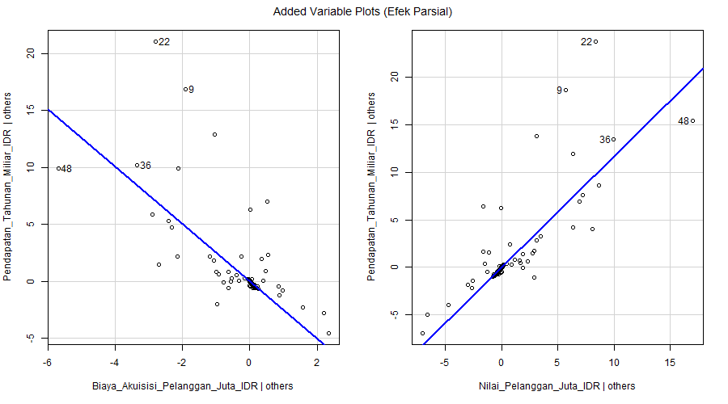

inerpretasi plot: 
Plot menunjukkan hubungan negatif yang jelas antara Pendapatan_Tahunan_Miliar_IDR (sumbu Y) dan Biaya_Akuisisi_Pelanggan_Juta_IDR (sumbu X) setelah mengontrol pengaruh Nilai_Pelanggan_Juta_IDR. Garis tren yang menurun dari kiri atas ke kanan bawah mengkonfirmasi koefisien regresi negatif (-2.5110) dari model. Artinya, setelah memperhitungkan nilai pelanggan, perusahaan dengan biaya akuisisi yang lebih tinggi cenderung memiliki pendapatan tahunan yang lebih rendah.
Plot kedua menunjukkan hubungan positif yang sangat kuat antara Pendapatan_Tahunan_Miliar_IDR (sumbu Y) dan Nilai_Pelanggan_Juta_IDR (sumbu X) setelah mengontrol pengaruh Biaya_Akuisisi_Pelanggan_Juta_IDR. Garis tren yang meningkat tajam dari kiri bawah ke kanan atas selaras dengan koefisien regresi positif (1.1686). Ini mengindikasikan bahwa setelah memperhitungkan biaya akuisisi, perusahaan dengan nilai pelanggan yang lebih tinggi secara konsisten menghasilkan pendapatan tahunan yang lebih besar.

Konsep "efek parsial" atau "ceteris paribus" (dengan hal lain dianggap tetap) divisualisasikan dengan jelas dalam plot ini:
- Setiap plot mengisolasi pengaruh satu variabel prediktor dengan mengontrol variabel lainnya
- Titik-titik yang lebih tersebar menunjukkan variasi yang tidak dapat dijelaskan sepenuhnya oleh model
- Kedekatan titik data dengan garis tren mengindikasikan kekuatan hubungan parsial


---

## 6. Kesimpulan
Dari analisis data 650 startup SaaS ini, saya menemukan cerita yang sangat menarik tentang bagaimana bisnis teknologi di Indonesia bekerja. Ternyata, rahasia pendapatan tinggi tidak terletak pada besarnya biaya akuisisi pelanggan, melainkan pada seberapa bernilai pelanggan yang didapat dan seberapa efisien cara mendapatkannya.
Wawasan kunci yang muncul: nilai pelanggan adalah pendorong utama pendapatan (setiap kenaikan 1 juta nilai pelanggan meningkatkan pendapatan 1.17 miliar), sementara biaya akuisisi yang tinggi justru merugikan (setiap tambahan 1 juta biaya akuisisi mengurangi pendapatan 2.51 miliar). Artinya, startup yang sukses bukan yang menghamburkan uang untuk mendapatkan pelanggan, tapi yang pandai mendapatkan pelanggan bernilai tinggi dengan cara yang efisien.
Industri ini juga memperlihatkan kesenjangan yang ekstrem: mayoritas startup bergerak di skala kecil (pendapatan paling umum hanya 1.87 miliar setahun), namun segelintir individu lokal dengan pendapatan hingga 66.89 miliar menarik rata-rata seluruh industri naik. Pola ini terlihat jelas dari distribusi data yang sangat miring ke kanan, dimana 50% startup terkonsentrasi di pendapatan rendah, sementara 25% teratas memiliki performa jauh lebih baik.
